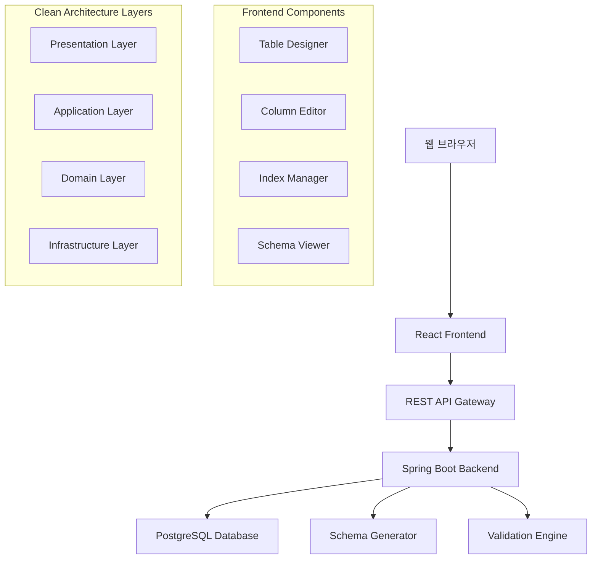

# 설계 문서

## 개요

MSSQL 데이터베이스 모델링 도구는 웹 기반의 단일 페이지 애플리케이션(SPA)으로 구현됩니다. 사용자는 직관적인 인터페이스를 통해 데이터베이스 스키마를 시각적으로 설계하고, 실시간으로 유효성 검사를 받으며, 최종적으로 MSSQL 호환 스크립트를 생성할 수 있습니다.

## 아키텍처

### 전체 시스템 아키텍처



### 기술 스택

- **프론트엔드**: React 19 + TypeScript + Tailwind CSS
- **상태 관리**: Zustand (가벼운 상태 관리)
- **UI 컴포넌트**: Headless UI + React Hook Form
- **다이어그램**: React Flow (테이블 관계 시각화)
- **백엔드**: Java 21 + Spring Boot 3.x
- **아키텍처**: Clean Architecture (헥사고날 아키텍처)
- **데이터베이스**: PostgreSQL 15+
- **ORM**: Spring Data JPA + Hibernate
- **API 문서**: OpenAPI/Swagger

## 컴포넌트 및 인터페이스

### 프론트엔드 컴포넌트 구조

```
src/
├── components/
│   ├── TableDesigner/
│   │   ├── TableCanvas.tsx          # 메인 설계 캔버스
│   │   ├── TableNode.tsx            # 개별 테이블 노드
│   │   └── RelationshipLine.tsx     # 테이블 간 관계선
│   ├── ColumnEditor/
│   │   ├── ColumnList.tsx           # 컬럼 목록
│   │   ├── ColumnForm.tsx           # 컬럼 편집 폼
│   │   └── DataTypeSelector.tsx     # MSSQL 데이터 타입 선택
│   ├── IndexManager/
│   │   ├── IndexList.tsx            # 인덱스 목록
│   │   └── IndexForm.tsx            # 인덱스 생성/편집
│   ├── ValidationPanel/
│   │   ├── NamingRules.tsx          # 네이밍 규칙 설정
│   │   └── ValidationResults.tsx    # 검증 결과 표시
│   └── SchemaExport/
│       ├── SqlPreview.tsx           # SQL 미리보기
│       └── ExportOptions.tsx        # 내보내기 옵션
├── services/
│   ├── api.ts                       # API 클라이언트
│   ├── validation.ts                # 클라이언트 검증 로직
│   └── sqlGenerator.ts              # SQL 생성 유틸리티
└── stores/
    ├── projectStore.ts              # 프로젝트 상태
    ├── tableStore.ts                # 테이블 상태
    └── validationStore.ts           # 검증 상태
```

### 백엔드 Clean Architecture 구조

```
src/main/java/com/dbmodeling/
├── presentation/                    # Presentation Layer
│   ├── controller/
│   │   ├── ProjectController.java   # 프로젝트 REST API
│   │   ├── TableController.java     # 테이블 REST API
│   │   ├── ColumnController.java    # 컬럼 REST API
│   │   ├── IndexController.java     # 인덱스 REST API
│   │   └── ExportController.java    # 스키마 내보내기 API
│   └── dto/
│       ├── request/                 # 요청 DTO
│       └── response/                # 응답 DTO
├── application/                     # Application Layer
│   ├── service/
│   │   ├── ProjectService.java      # 프로젝트 비즈니스 로직
│   │   ├── TableService.java        # 테이블 비즈니스 로직
│   │   ├── ValidationService.java   # 네이밍 규칙 검증
│   │   └── ExportService.java       # 스키마 내보내기
│   ├── usecase/
│   │   ├── CreateProjectUseCase.java
│   │   ├── UpdateTableUseCase.java
│   │   └── GenerateSchemaUseCase.java
│   └── port/
│       ├── in/                      # Inbound Ports (Use Cases)
│       └── out/                     # Outbound Ports (Repository Interfaces)
├── domain/                          # Domain Layer
│   ├── model/
│   │   ├── Project.java             # 프로젝트 도메인 모델
│   │   ├── Table.java               # 테이블 도메인 모델
│   │   ├── Column.java              # 컬럼 도메인 모델
│   │   ├── Index.java               # 인덱스 도메인 모델
│   │   └── NamingRules.java         # 네이밍 규칙 도메인 모델
│   ├── service/
│   │   ├── SqlGeneratorService.java # MSSQL 스크립트 생성
│   │   └── ValidationDomainService.java
│   └── repository/                  # Repository Interfaces
│       ├── ProjectRepository.java
│       ├── TableRepository.java
│       └── ColumnRepository.java
└── infrastructure/                  # Infrastructure Layer
    ├── persistence/
    │   ├── entity/                  # JPA Entities
    │   ├── repository/              # JPA Repository 구현체
    │   └── mapper/                  # Entity-Domain 매퍼
    ├── config/
    │   ├── DatabaseConfig.java      # 데이터베이스 설정
    │   ├── SwaggerConfig.java       # API 문서 설정
    │   └── ValidationConfig.java    # 검증 설정
    └── external/
        └── mssql/
            ├── MSSQLTypeMapper.java # MSSQL 데이터 타입 매핑
            └── SchemaGenerator.java # SQL 스크립트 생성기
```

### 주요 API 엔드포인트

```typescript
// 프로젝트 관리
GET    /api/projects                 # 프로젝트 목록
POST   /api/projects                 # 프로젝트 생성
GET    /api/projects/:id             # 프로젝트 조회
PUT    /api/projects/:id             # 프로젝트 수정
DELETE /api/projects/:id             # 프로젝트 삭제

// 테이블 관리
GET    /api/projects/:id/tables      # 테이블 목록
POST   /api/projects/:id/tables      # 테이블 생성
PUT    /api/tables/:id               # 테이블 수정
DELETE /api/tables/:id               # 테이블 삭제

// 컬럼 관리
POST   /api/tables/:id/columns       # 컬럼 추가
PUT    /api/columns/:id              # 컬럼 수정
DELETE /api/columns/:id              # 컬럼 삭제

// 인덱스 관리
POST   /api/tables/:id/indexes       # 인덱스 생성
PUT    /api/indexes/:id              # 인덱스 수정
DELETE /api/indexes/:id              # 인덱스 삭제

// 검증 및 내보내기
POST   /api/projects/:id/validate    # 네이밍 규칙 검증
POST   /api/projects/:id/export      # 스키마 내보내기
```

## 데이터 모델

### PostgreSQL 스키마 설계

```sql
-- 프로젝트 테이블
CREATE TABLE projects (
    id UUID PRIMARY KEY DEFAULT gen_random_uuid(),
    name VARCHAR(255) NOT NULL,
    description TEXT,
    naming_rules JSONB,
    created_at TIMESTAMP DEFAULT NOW(),
    updated_at TIMESTAMP DEFAULT NOW()
);

-- 테이블 정의
CREATE TABLE tables (
    id UUID PRIMARY KEY DEFAULT gen_random_uuid(),
    project_id UUID REFERENCES projects(id) ON DELETE CASCADE,
    name VARCHAR(255) NOT NULL,
    description TEXT,
    position_x INTEGER DEFAULT 0,
    position_y INTEGER DEFAULT 0,
    created_at TIMESTAMP DEFAULT NOW(),
    updated_at TIMESTAMP DEFAULT NOW()
);

-- 컬럼 정의
CREATE TABLE columns (
    id UUID PRIMARY KEY DEFAULT gen_random_uuid(),
    table_id UUID REFERENCES tables(id) ON DELETE CASCADE,
    name VARCHAR(255) NOT NULL,
    description TEXT,
    data_type VARCHAR(100) NOT NULL,
    max_length INTEGER,
    precision_value INTEGER,
    scale_value INTEGER,
    is_nullable BOOLEAN DEFAULT TRUE,
    is_primary_key BOOLEAN DEFAULT FALSE,
    is_identity BOOLEAN DEFAULT FALSE,
    identity_seed INTEGER DEFAULT 1,
    identity_increment INTEGER DEFAULT 1,
    default_value TEXT,
    order_index INTEGER NOT NULL,
    created_at TIMESTAMP DEFAULT NOW(),
    updated_at TIMESTAMP DEFAULT NOW()
);

-- 인덱스 정의
CREATE TABLE indexes (
    id UUID PRIMARY KEY DEFAULT gen_random_uuid(),
    table_id UUID REFERENCES tables(id) ON DELETE CASCADE,
    name VARCHAR(255) NOT NULL,
    type VARCHAR(50) NOT NULL, -- 'CLUSTERED', 'NONCLUSTERED'
    is_unique BOOLEAN DEFAULT FALSE,
    columns JSONB NOT NULL, -- [{"column_id": "uuid", "order": "ASC"}]
    created_at TIMESTAMP DEFAULT NOW(),
    updated_at TIMESTAMP DEFAULT NOW()
);
```

### TypeScript 인터페이스

```typescript
interface Project {
  id: string;
  name: string;
  description?: string;
  namingRules: NamingRules;
  tables: Table[];
  createdAt: Date;
  updatedAt: Date;
}

interface Table {
  id: string;
  projectId: string;
  name: string;
  description?: string;
  positionX: number;
  positionY: number;
  columns: Column[];
  indexes: Index[];
  createdAt: Date;
  updatedAt: Date;
}

interface Column {
  id: string;
  tableId: string;
  name: string;
  description?: string;
  dataType: MSSQLDataType;
  maxLength?: number;
  precision?: number;
  scale?: number;
  isNullable: boolean;
  isPrimaryKey: boolean;
  isIdentity: boolean;
  identitySeed?: number;
  identityIncrement?: number;
  defaultValue?: string;
  orderIndex: number;
}

interface Index {
  id: string;
  tableId: string;
  name: string;
  type: 'CLUSTERED' | 'NONCLUSTERED';
  isUnique: boolean;
  columns: IndexColumn[];
}

interface IndexColumn {
  columnId: string;
  order: 'ASC' | 'DESC';
}

interface NamingRules {
  tablePrefix?: string;
  tableSuffix?: string;
  tablePattern?: string;
  columnPattern?: string;
  indexPattern?: string;
  enforceCase?: 'UPPER' | 'LOWER' | 'PASCAL' | 'SNAKE';
}
```

## 오류 처리

### 클라이언트 오류 처리

```typescript
// 전역 오류 처리
interface ApiError {
  code: string;
  message: string;
  details?: any;
}

// 검증 오류
interface ValidationError {
  field: string;
  rule: string;
  message: string;
  suggestion?: string;
}
```

### 서버 오류 응답

```typescript
// 표준 오류 응답 형식
{
  "error": {
    "code": "NAMING_RULE_VIOLATION",
    "message": "테이블 이름이 네이밍 규칙을 위반했습니다",
    "details": {
      "field": "tableName",
      "expected": "tbl_*",
      "actual": "Users",
      "suggestion": "tbl_Users"
    }
  }
}
```

### 오류 처리 전략

1. **네트워크 오류**: 자동 재시도 (최대 3회)
2. **검증 오류**: 실시간 피드백 및 수정 제안
3. **서버 오류**: 사용자 친화적 메시지 표시
4. **동시성 오류**: 충돌 감지 및 병합 옵션 제공

## 테스트 전략

### 단위 테스트

- **프론트엔드**: Jest + React Testing Library
- **백엔드**: JUnit 5 + Mockito + Spring Boot Test
- **커버리지 목표**: 80% 이상

### 통합 테스트

- API 엔드포인트 테스트
- 데이터베이스 연동 테스트
- SQL 생성 정확성 테스트

### E2E 테스트

- Playwright를 사용한 주요 사용자 플로우 테스트
- 테이블 생성부터 스키마 내보내기까지 전체 워크플로우

### 테스트 시나리오

1. **기본 워크플로우**: 프로젝트 생성 → 테이블 추가 → 컬럼 설정 → 스키마 내보내기
2. **네이밍 규칙 검증**: 규칙 설정 → 위반 사항 감지 → 수정 제안
3. **복잡한 인덱스**: 복합 인덱스 생성 → SQL 생성 검증
4. **동시 편집**: 여러 사용자 동시 접근 시나리오

## 성능 고려사항

### 프론트엔드 최적화

- **가상화**: 대량 테이블/컬럼 목록을 위한 가상 스크롤
- **메모이제이션**: React.memo와 useMemo를 통한 불필요한 리렌더링 방지
- **지연 로딩**: 큰 프로젝트의 점진적 로딩
- **디바운싱**: 실시간 검증의 API 호출 최적화
- **변경사항 추적**: 저장되지 않은 변경사항 감지 및 페이지 이탈 시 경고

### 백엔드 최적화

- **데이터베이스 인덱싱**: 자주 조회되는 필드에 인덱스 설정
- **쿼리 최적화**: N+1 문제 방지를 위한 eager loading
- **캐싱**: Redis를 통한 검증 규칙 캐싱
- **배치 처리**: 대량 변경사항의 배치 업데이트

### 확장성 고려사항

- **수평 확장**: 상태 비저장 API 설계
- **데이터베이스 샤딩**: 프로젝트별 데이터 분산 가능성
- **CDN**: 정적 자산 배포 최적화